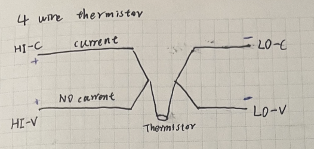
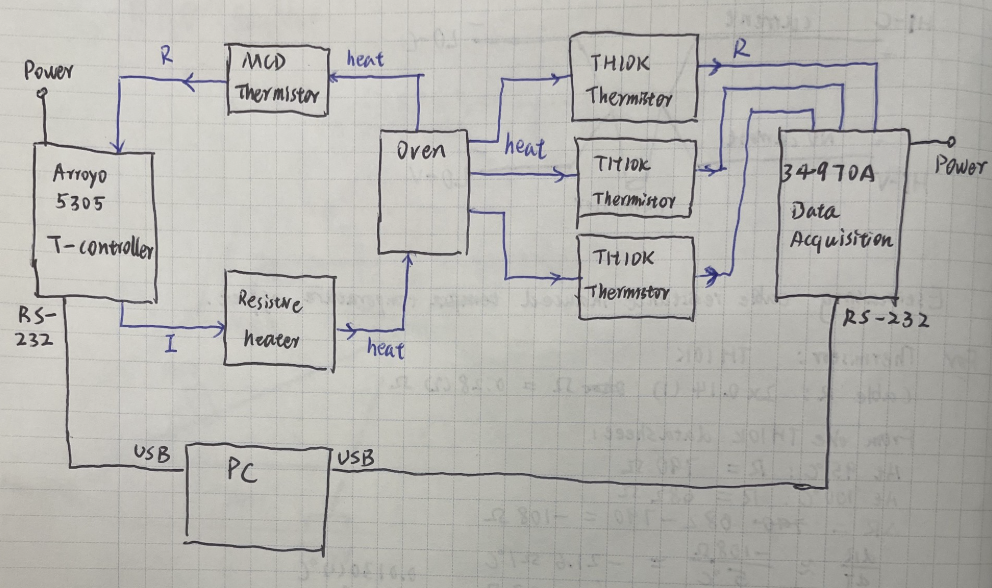
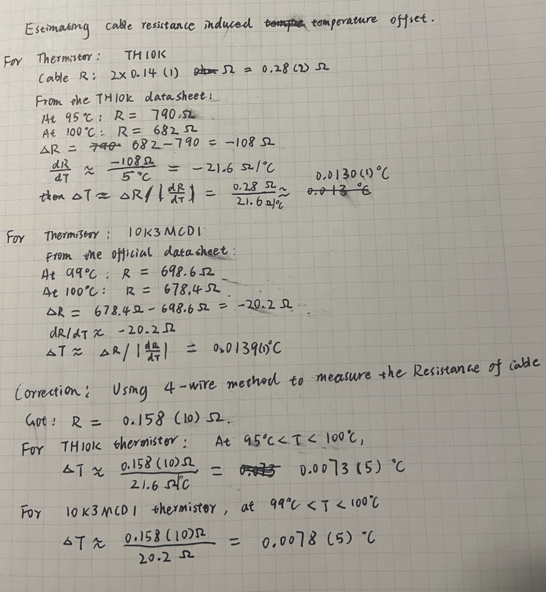
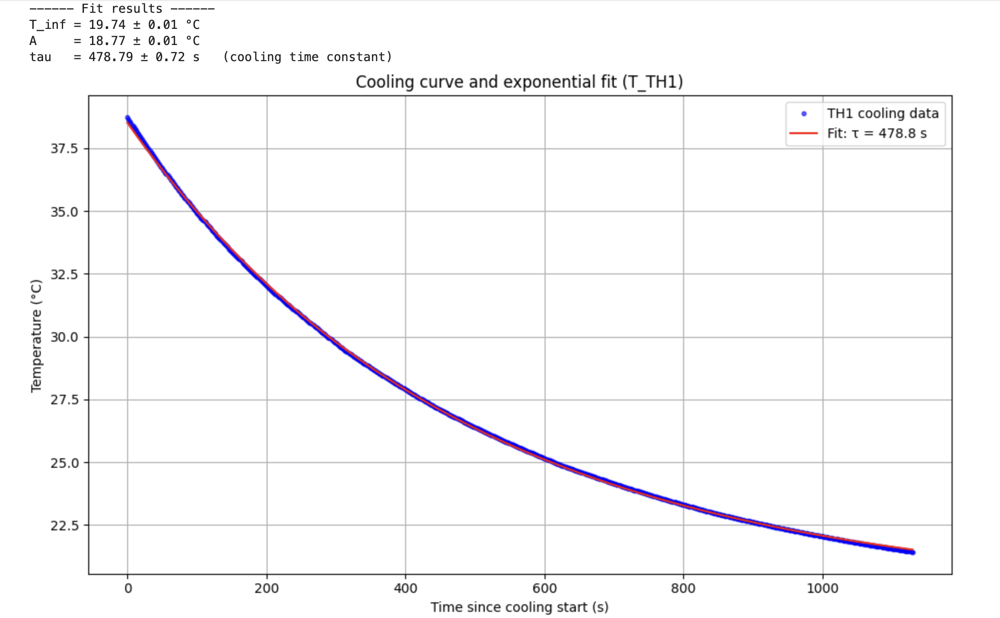
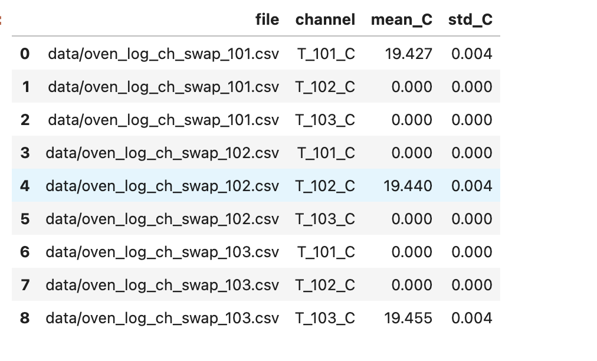

# Preparation of Characterization of Oven Heating


author: zhen.mi

last\_updated: 2025-11


## Introduction

In our SHG (Second Harmonic Generation) setup, the crystal temperature is one of the most critical factors for achieving stable and efficient frequency doubling. We need to confirm that our oven can provide a sufficiently uniform and predictable thermal environment for the SHG crystal. The goal is to directly measure how the temperature distributes and evolves inside the oven during heating, stabilization, and cooling. By placing several thermistors at different positions, we can determine the internal temperature gradients and see whether the crystal would experience uneven heating that might reduce SHG efficiency or even risk damaging it. The results will tell us if the current oven design is suitable, or if modifications are needed before integrating it into the SHG setup.

## Method

### Some Hardwares

| Device                                          | Role in Experiment                                                                       | Major Specs (short)                                                    |
| ----------------------------------------------- | ---------------------------------------------------------------------------------------- | ---------------------------------------------------------------------- |
| **Oven (copper) + PEEK insulation (Oven+PEEK)** | Provides thermal environment for SHG crystal; object under test for gradient measurement | Copper block, internal crystal slots; PEEK                             |
| **Arroyo 5305 TECSource (TEC)**                 | Drives heater and controls temperature via MCD sensor                                    | ±5 A, ±12 V, 60 W output; thermistor/RTD support;                      |
| **MCD Thermistor (MCD)**                        | Primary control sensor connected to 5305                                                 | 10 kΩ NTC; ±0.2 °C tolerance; fast response; thin tip                  |
| **TH10K Thermistors (TH)**                      | Independent gradient measurement at 3 positions                                          | 10 kΩ NTC; 1 °C accuracy; \~1.4 mW/°C dissipation; −50 to 150 °C range |
| **Keysight 34970A (DAQ)**                       | Logs all TH10K thermistor temperatures                                                   | 6½-digit DMM; thermistor mode; multi-channel scanning                  |

### **Think About How High Resolution We Need**

LBO’s SHG output power vs temperature has a FWHM of a few kelvin (See msc\_lennart\_guth\_2021), a 0.1K resolution is quite small compared to FWHM of a few kelvin. So a target temperature resolution of 0.1K should be reasonably good.

### **Four-Wire Thermistor Measurement**

A four-wire configuration removes the influence of lead resistance when measuring a thermistor’s true resistance. Two wires carry the excitation current, while the other two sense the voltage directly across the thermistor. Because the sensing pair draws virtually no current, the measured voltage reflects only the thermistor resistance, improving temperature accuracy.

<figure><figcaption></figcaption></figure>

### Time Constant of Oven&#x20;

The **thermal time constant** τ describes how quickly the oven responds to a temperature change. In a first-order model, the temperature evolution is given by:&#x20;

$$
T(t) = T_{\infty} - (T_{\infty} - T_0)\, e^{-t/\tau}.
$$

In this experiment, τ determines how long we should wait before evaluating temperature stability:\
the stability-logging period should be longer than one time constant to ensure meaningful measurements.

Reference: [https://eng.libretexts.org/Bookshelves/Industrial\_and\_Systems\_Engineering/Introduction\_to\_Control\_Systems\_%28Iqbal%29/01%3A\_Mathematical\_Models\_of\_Physical\_Systems/1.02%3A\_First-Order\_ODE\_Models](https://eng.libretexts.org/Bookshelves/Industrial_and_Systems_Engineering/Introduction_to_Control_Systems_\(Iqbal\)/01%3A_Mathematical_Models_of_Physical_Systems/1.02%3A_First-Order_ODE_Models)

### Setup Schematic Diagram

<figure><figcaption></figcaption></figure>

### Adhesive Selection

###

## Result

### Cable Resistance Calculation & Determine Whether to Adopt 4-Wire Thermistor Approach

Using 4 wire method, measured the cable resistance, the corresponding temperature shift for TK10K is 0.0073(5) °C at temperature 95-100 °C, for MCD thermistor is 0.0078(5) °C at temperature 99-100 °C.

<figure><figcaption></figcaption></figure>

Decide to directly use 2-wire method for both MCD and TH10K thermistor, because:&#x20;

1, this cable induced temp shift is much smaller than thermistors' resistance tolerance / temperature accuracy, see manuals.&#x20;

2, for temperature gradient measurement, we care more about the relative temperature discrepancy, not absolute offset (assuming the cable resistances of all thermistors are similar)

### Thermistor Self-heating Effect

Given TH10K thermistor's dissipation constant C of 1.4 mW/°C in the manual, and 100 µA for 10 kΩ configuration of Data acquisition 34970A, the temperature shift induced by self-heating effect of TH10K thermistor is around 0.07 °C (I^2\*R/C), this is still relatively small compared to our target temperature resolution, and can be ignored in relative temperature gradient characterization.

### Time Constant of Oven+PEEK

A time series plot from Autotune test, the rising-up and flat phases correspond to PID Autotune process, the decay phase denotes natural cooling down after the PID autotune is done

<figure><figcaption></figcaption></figure>

Cooling curve fit and Time constant calculation, based on TH1 data

<figure><figcaption></figcaption></figure>

[ ](https://qsim-mattermost.uni-freiburg.de/oneworld/threads/jp13h6bwa38s5qasfqjic4r7iy)For a 8 min time constant of oven+PEEK, a 20 min window is sufficiently long and a good choice for stability analysis

### DAQ Channel Swapping Check 

Measure the thermistor for 2 minutes to weaken/avoid the possible warm-up issue, then move the thermistor from channel 101 to 102, 103 on DAQ, got the following result, I see the discrepancies are around 0.01°C, which is negligible.

