# Characterization of Temperature Reading Resolution


author: zhen.mi

last\_updated: 2025-12-09


## Method

### Relative Temperature Discrepancy of Thermistors

Because in our setup, we are using 3 TH10K thermistors, each of them may has slightly different Resistance to Temperature coefficients. What we care more about is if the relative temperature discrepancy among thermistors are stable. Thus we use boiling water to observe how the temperature readings of these three TH10K thermistors change as the water cools down.

Pour right-boiled water at nearly 100C into the glass cup, get thermometers very close to each other, so that the exact spatial temperature discrepancies they are experiencing can be negligible.

<figure>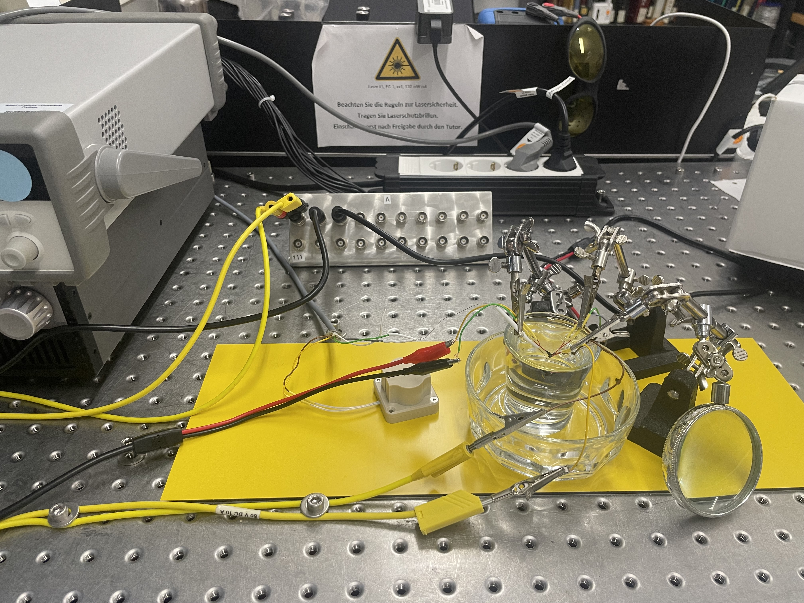<figcaption></figcaption></figure>

### Data Reading Stability Test at Room Temperature

As the prerequisite of measuring temperature gradient of oven, we first need to know the resolution of our temperature reading setup. We measure the temperature readings of these three TH10K thermistors.  Put a box on to weaken the influence of air motion and surrounding heat source.

<figure>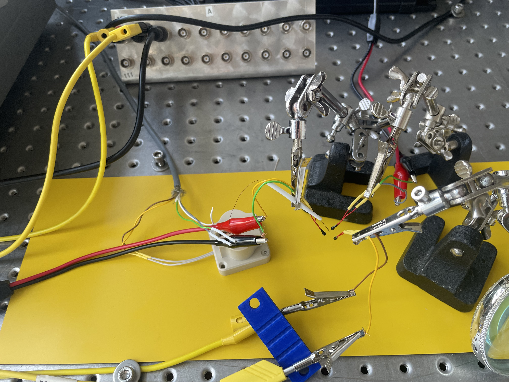<figcaption></figcaption></figure> <figure><figcaption></figcaption></figure>

### Re-measurement with DAQ in R-mode and TEC using customized S-H coefficients

To obtain a more accurate temperature data, I decide to stop using DAQ's built-in Resistance to Temperature transform engine, but directly fetch resistance data from DAQ, then convert to temperature according to the piecewise formula provided in thermistor's own datasheet.

<figure>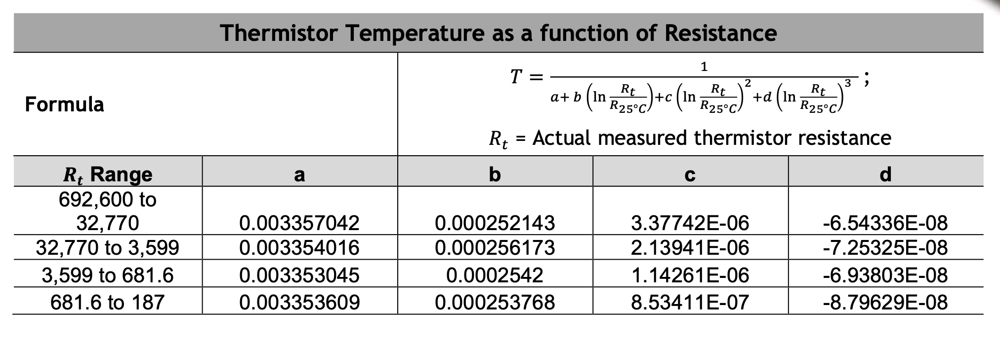<figcaption></figcaption></figure>

Similar for TEC, we compute the Steinhart-Hart coefficients using the R-T table of MCD thermistor, then set TEC's ThermalA, ThermalB, ThermalC to get a more accurate sensor reading for MCD thermistor.

<figure>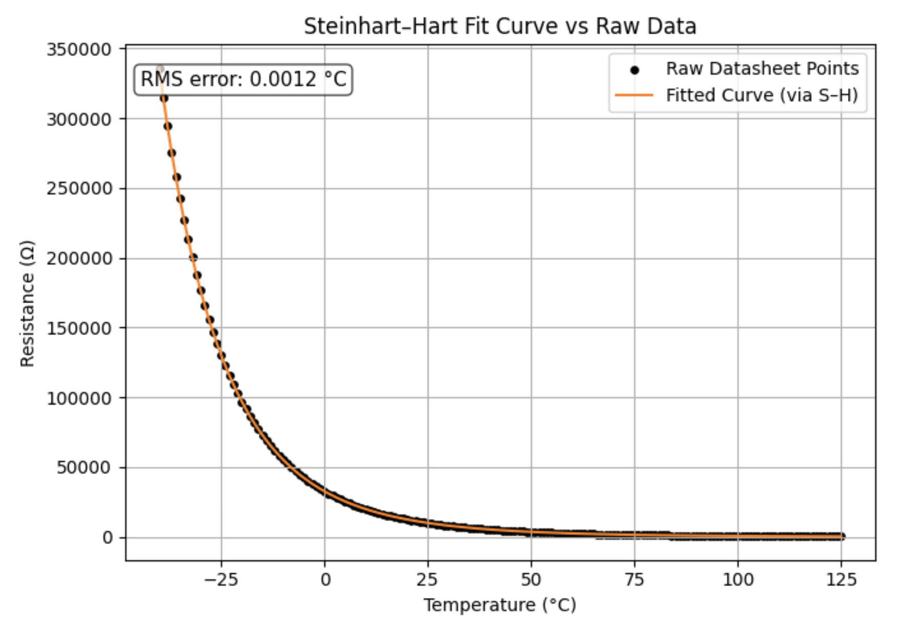<figcaption></figcaption></figure>

<figure>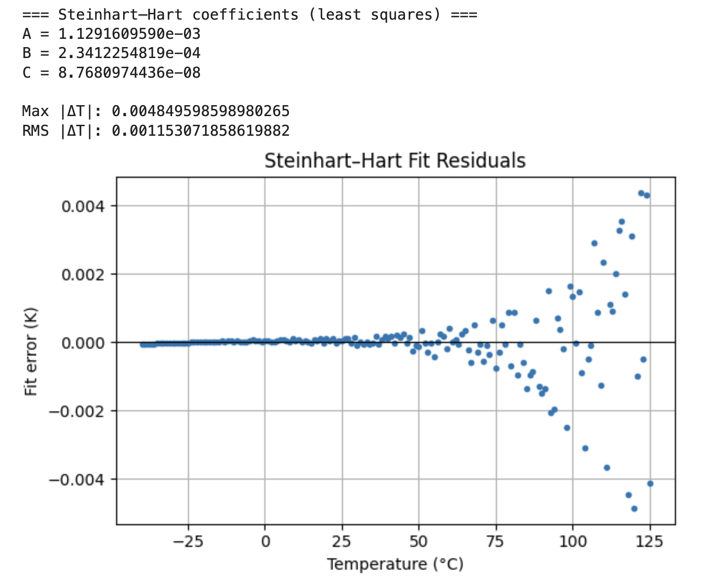<figcaption></figcaption></figure>

Caption: Using least-square method, compute the Steinhart-Hart coefficients and make fit error plot, showing very good agreement at low temperature range and relatively large error which is still in acceptable range at high temperature condition.

## Result

### Temperature Change of Hot Water Cooling down

<figure>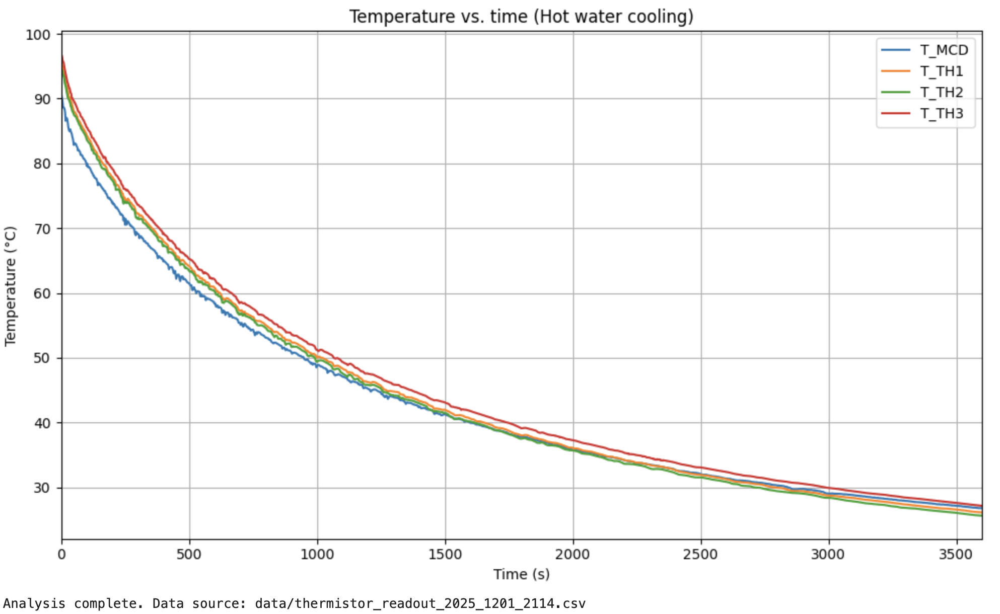<figcaption></figcaption></figure>

Caption: Time series plot

<figure>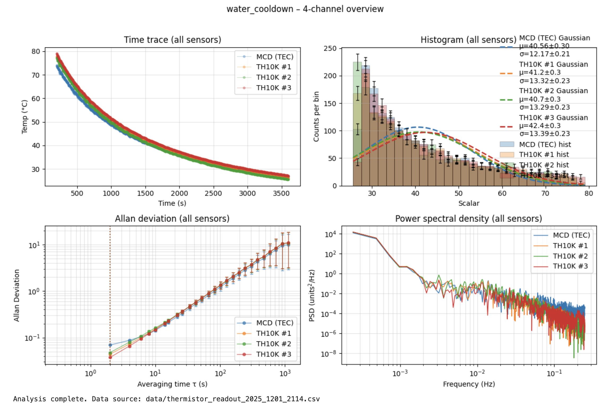<figcaption></figcaption></figure>

#### Relative discrepancy analysis

To better observe the change of temperature reading discrepancy of thermistors, we subtract the temperature of one TH10K by the mean of the other two TH10K to generate a new discrepancy dataset, and re-do the data analysis.

<figure>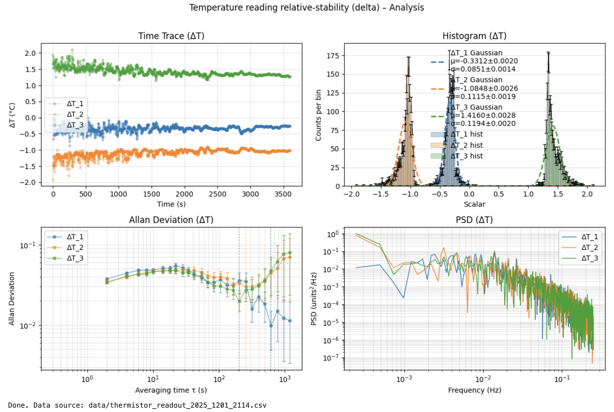<figcaption></figcaption></figure>

Caption: From the time series plot, we see the data fluctuation is getting smaller, from the Histogram plot, we see some deviation from normal distribution, indicating the Steinhart–Hart coefficients slightly differ among these TH10K thermistors

#### Worse resolution in water

Considering the unknown thermal dynamics of water around thermistor tip, and water's thermal conductivity much larger than air, the actual resolution of temperature reading should be better than what we get from this data measured. This can also be shown from the Temperature reading stability test, see figure below.

<figure>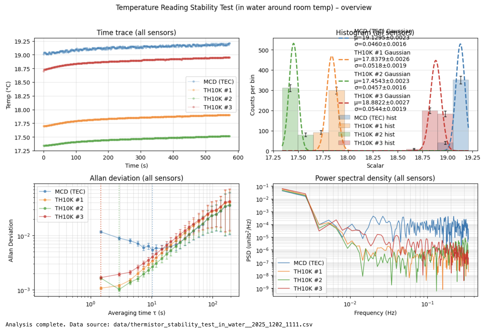<figcaption></figcaption></figure>

Caption: This measurement data was done by immersing all four thermistors into cold water which has been left in the room temperature for a long time. From Allan plot, we could see the mean resolution value of three TH10K thermistors is larger than in air, so does of MCD thermistor. Thus, we can say, the resolution of temperature reading setup in air is better than in water.

### Temperature Reading Stability Test in Air at Room Temperature

<figure><figcaption></figcaption></figure>

Caption:  Temperature reading stability analysis for all thermistors, including three TH10 and one MCD, the first plot shows a possible influence of environmental temperature rising up. From the Allan plot, we could see the resolution at short time scale.

#### Relative discrepancy analysis

Following the same logic, to eliminate or weaken the influence of environmental temperature change, we subtract the temperature of one TH10K by the mean of the other two TH10K to generate a new discrepancy dataset, and re-do the data analysis.

<figure>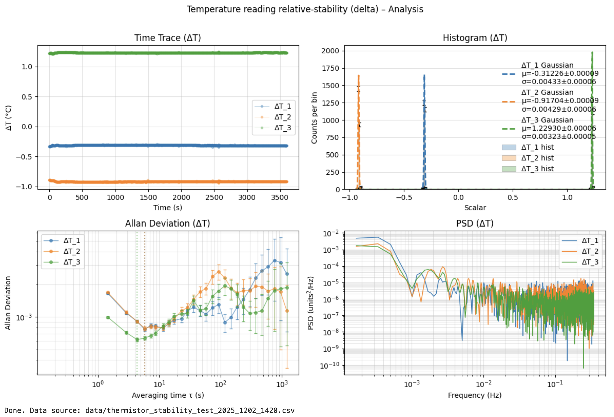<figcaption></figcaption></figure>

Caption: From plot Histogram, we could see the standard deviations of temperature readings are around 0.004K. From Allan plot, we see the resolution at short time scale is on a scale of 10⁻³, we could also observe the deviation from other time scale

### Re-measurement Result of Temperature Reading Stability Test in Air at Room Temperature

<figure>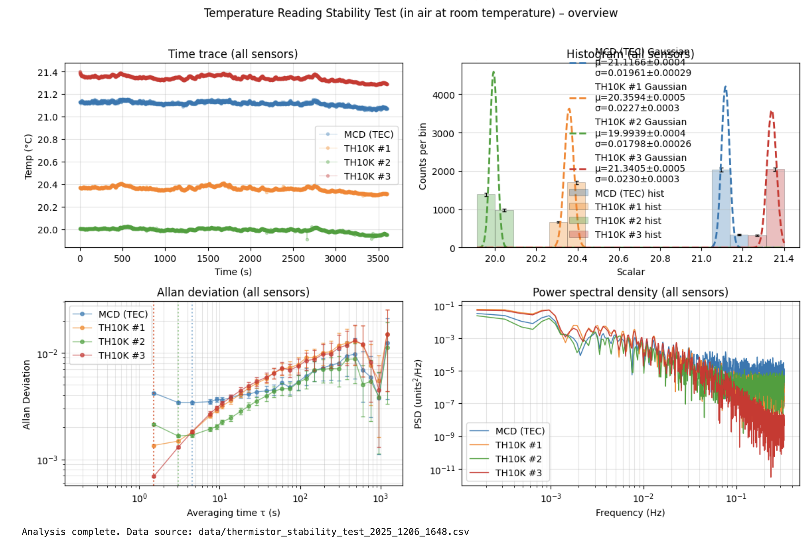<figcaption></figcaption></figure>

<figure>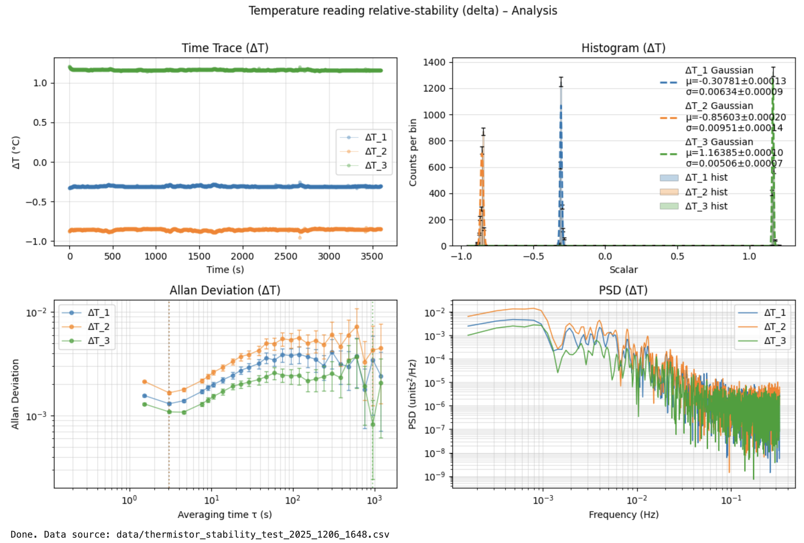<figcaption></figcaption></figure>

Caption: Delta T analysis of three TH10K thermistors, the temperature resolution is higher than 0.01K

### Re-measurement Result of Temperature Reading Discrepancy Test in Hot Water Cooling Down

<figure>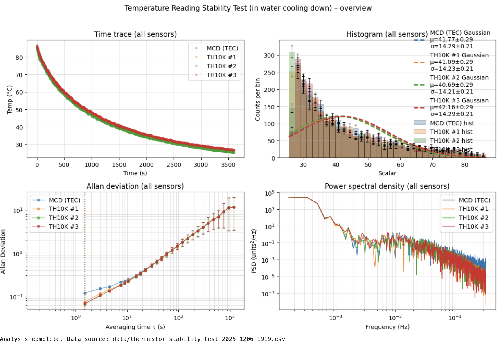<figcaption></figcaption></figure>

<figure>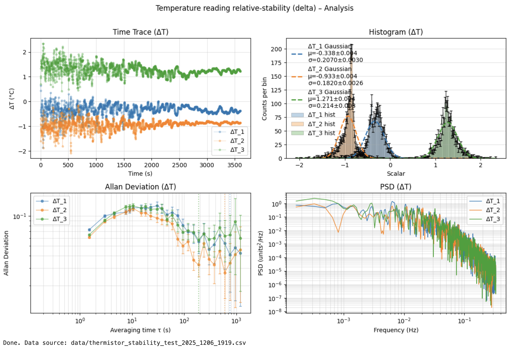<figcaption></figcaption></figure>

Caption: \
1, compared to last time, the T fluctuation at high temperature is larger, one thing has changed in setup is that thermistors are spatially closer to each other in water.\
2, the reading discrepancy among three TH10K is still gradually shrinking as water cools down, means each TH10K thermistor has its own R-T curve.\
3, MCD reading aligns with TH10K much better than last time, since TEC was using MCD's dedicated S-H coefficients and DAQ was working in R mode

<figure>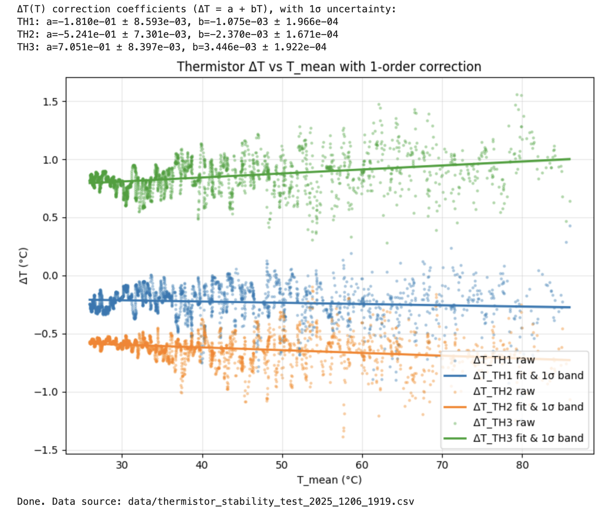<figcaption></figcaption></figure>

Caption: Use a linear fit for ΔT(T) because the sample data show relatively large scatter, and I don't exactly know how the true thermal distribution in the water looks like. Using a higher-order fit could easily overfit the noise. From the plot, we see that the temperature discrepancy between the three TH10K thermistors increases slightly with temperature, this is consistent with our earlier measurements performed with the DAQ in T-mode.

## Conclusion

Assuming the temperature difference thermistors are experiencing is negligible, either in air or hot water cooling down.

The stability test in room temperature air shows a good temperature resolution of below 0.01K.

The cooling-down test shows that all thermistors follow the thermal decay consistently, but each TH10K has its own R-T curve coefficients, leading to the slightly changing temperature reading discrepancy.

The temperature reading fluctuation is significantly larger than in air, with the resolution of around 0.2K, it might be due to the complex thermal dynamics inside the hot water. 0.2K is larger than our target temperature resolution 0.1K, but given the worse temperature resolution measured in room temperature water than in room temperature air, we can expect, the true temperature reading resolution could be better in cavity at high temperature.&#x20;

Further improvement:

To theorectically calculate the limit of resolution of DQA, we can determine the R-T slope at specific temperature and then check DQA's sensitivity to resistance. In other words, we convert the smallest detectable resistance change of the DAQ (one bit step) into an equivalent temperature change. This gives the theoretical temperature resolution achievable at that operating point.

Test the T resolution in oven cavity.

Updating...

