# Simplified Oven Thermal Simulation

Software: Autodesk Fusion&#x20;

Official tutorial: [https://help.autodesk.com/view/fusion360/ENU/?guid=SIM-TA](https://help.autodesk.com/view/fusion360/ENU/?guid=SIM-TA)

<figure>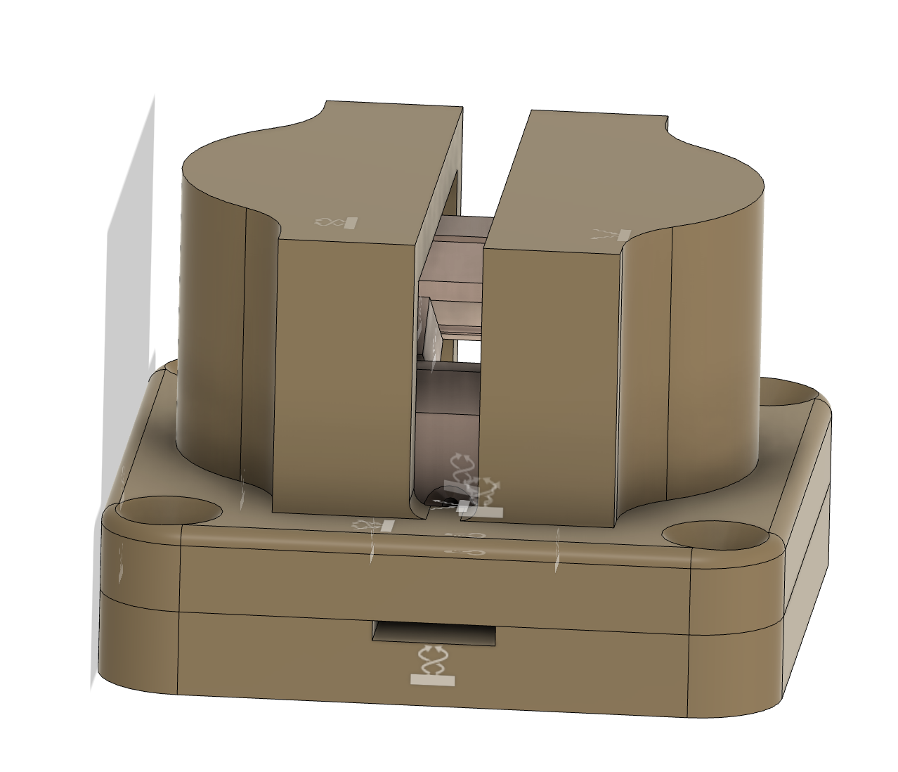<figcaption></figcaption></figure>

## Method

### Add Heating Effect

There are three load types which can be used as heat source:

* Applied temperature
* Heat source
* Internal heat

In our case, the temperature sensor is placed inside a pinhole at lower part of oven with a stable temperature controlled by PID temperature controller. As an approximation, I choose applied temperature and apply it on a square area at the oven bottom which corresponds to the contact area against the heater, also same for the contact area of PEEK.&#x20;

<figure>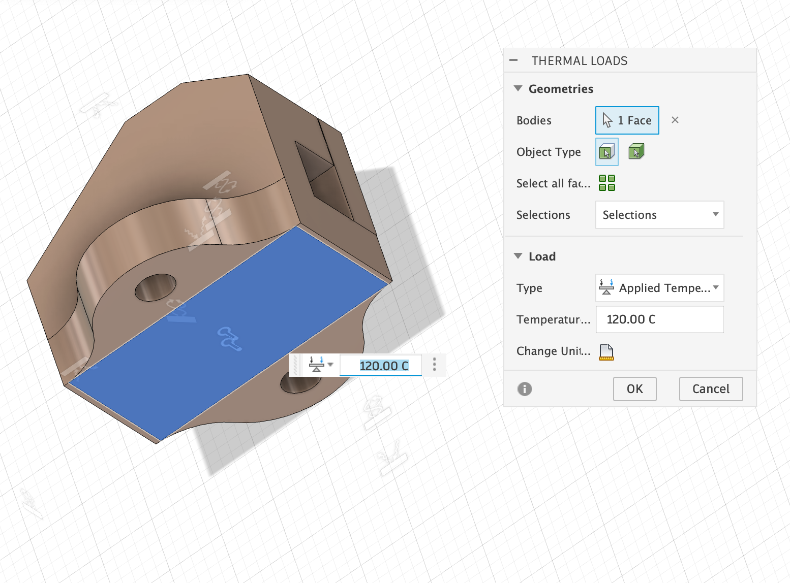<figcaption></figcaption></figure> <figure>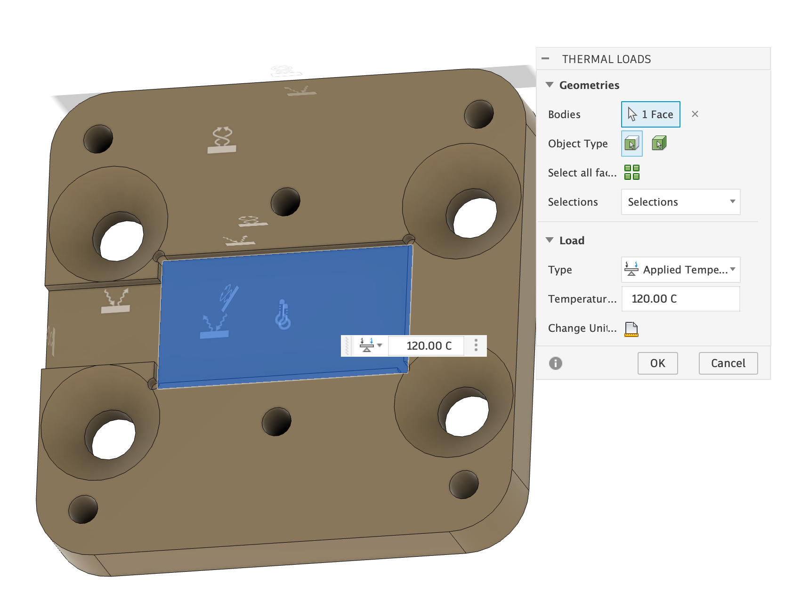<figcaption></figcaption></figure>

Caption: Applied temperature is set for area which the heater directly heat, in actual case, the temperature of heater surface is not perfectly evenly distributed, as a approximation, we treat these areas as isothermal.&#x20;

### Choose Material

Choose corresponding materials in material property setting.

<figure>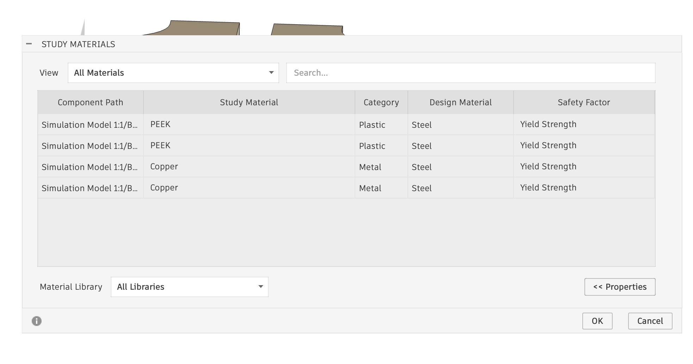<figcaption></figcaption></figure>

### Heat Loss

To reach a thermal equillibrium state, besides heating source, there must be heat loss as well. There are two major sources of heat loss.&#x20;

* Convective heat transfer: Heat exchange with its ambient environment which is air in our case
* Natural thermal radiation

### Add Convection Conditions

Convective heat transfer can be \[ref.1]:

* Forced or Assisted convection
* Natural or Free convection

#### Forced or Assisted convection:

Occurs when a fluid flow is induced by an external force, such as a pump, fan or a mixer.

The equation for convection can be expressed as:

$$
q = h_c \, A \, \Delta T
$$

where:

* **q** = heat transferred per unit time\
  &#xNAN;_(W, Btu/hr)_
* **A** = heat transfer area of the surface\
  &#xNAN;_(m², ft²)_
* **h\_c​** = convective heat transfer coefficient of the process _(W/(m²·°C), Btu/(ft²·h·°F)),_ depends on type of media, if its gas or liquid, and flow properties such as velocity, viscosity and other flow and temperature dependent properties
* **ΔT** = temperature difference between the surface and the bulk fluid\
  &#xNAN;_(°C, °F)_

#### Natural or Free convection

Caused by buoyancy forces due to dens ity differences caused by temperature variations in the fluid. At heating the density change in the boundary layer will cause the fluid to rise and be replaced by cooler fluid that also will heat and rise. This continues phenomena is called free or natural convection.

$$
h_{c} = 1.16 \left( 10.45 - v + 10 v^{1/2} \right)
$$

where

v = relative speed between object surface and air (m/s)

h\_c = heat transfer coefficient (W/m^2°K)

This is an empirical equation and can be used for velocities _2_ to _20 m/s_.

#### Choice of Heat Transfer Coefficient

For still air, the heat transfer coefficient (convection value in Fusion setting) can range from 5 to 10 W/m^2°K \[ref.1, ref.2]

#### Selection of Applied Faces&#x20;

The oven is largely covered by PEEK insulation with some gap in between and a small area directly exposed to air. The state of air flow inside this semi-closed structure is unknown and might be quite complex. Therefore, as an approximation, I treat the air convection states of air outside and inside the PEEK as same, that's to say, the convection coefficients applied on surfaces of both external and internal are same.&#x20;

As to the configuration of ambient temperature, considering the temperature in between PEEK and oven higher than outside of PEEK, it's reasonable to set a higher ambient temperature for faces inside the PEEK, including internal faces of PEEK and all faces of oven.



<figure>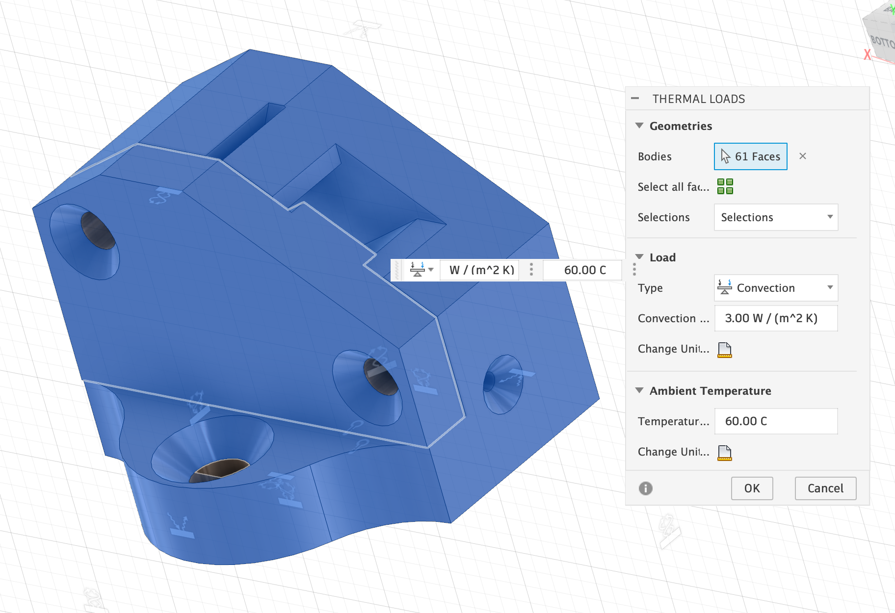<figcaption></figcaption></figure>



<figure>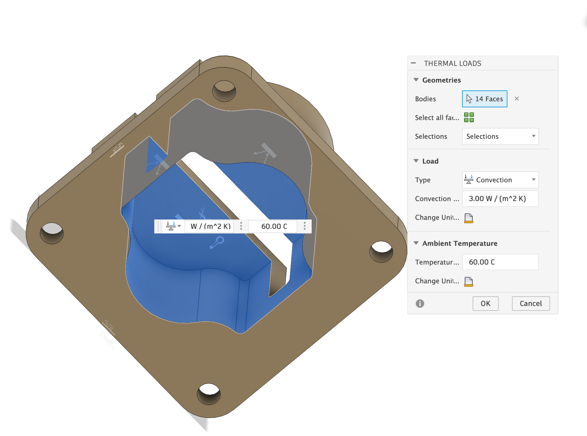<figcaption></figcaption></figure>





<figure>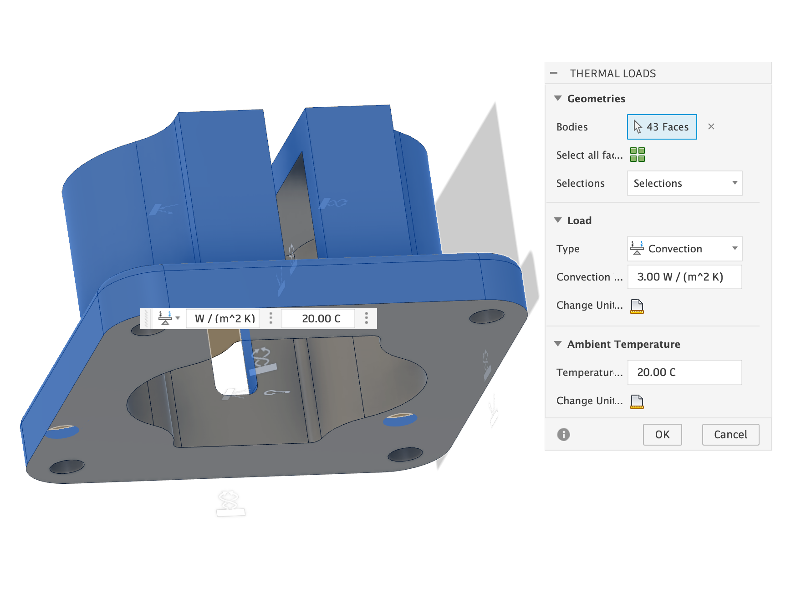<figcaption></figcaption></figure>




<figure>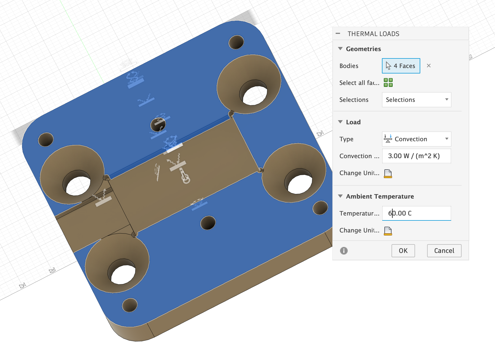<figcaption></figcaption></figure>



Caption: for surfaces inside the PEEK insulation, we treat their convection coefficient same as outside, but with different ambient temperature assignments. As screw components are missing from the model, inner surfaces of screw holes are excluded.

### Add Radiation Effect

The total radiation intensity of a black body rises as the fourth power of the absolute temperature, as expressed by the [Stefan–Boltzmann law](https://en.wikipedia.org/wiki/Stefan%E2%80%93Boltzmann_law). This radiation effect will dominant when the surface temperature of object is much higher than ambient temperature.

In the general case, the Stefan–Boltzmann law for radiant exitance is given by

$$
M = \varepsilon \sigma T^{4}
$$

where:

* **M** = radiant exitance of the surface _(W/m²)_
* **ε** = emissivity of the emitting surface
* **σ** = Stefan–Boltzmann constant
* **T** = absolute temperature of the surface _(K)_

The emissivity **ε** ranges between 0 and 1. An emissivity of **1** corresponds to an **ideal black body**

For polished copper, emissivity can be 0.023 - 0.052, for Annealed Copper, it can be 0.78. \[ref.3].

Since the copper oven is heated and could be oxidized, value selection from 0.05 to 0.78 should be reasonable.

For PEEK, we could take emissivity as 0.95 \[ref.4]

#### Selection of Applied Faces

This step is very similar as in convection process. According to the difference of temperature experienced by surfaces inside and outside the PEEK, I set difference ambient temperatures for them.



<figure>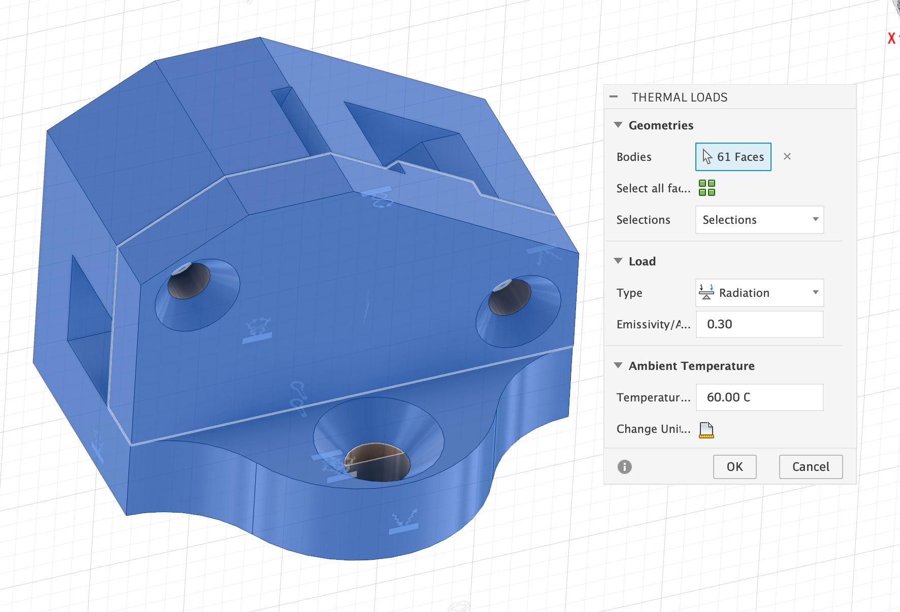<figcaption></figcaption></figure>



<figure>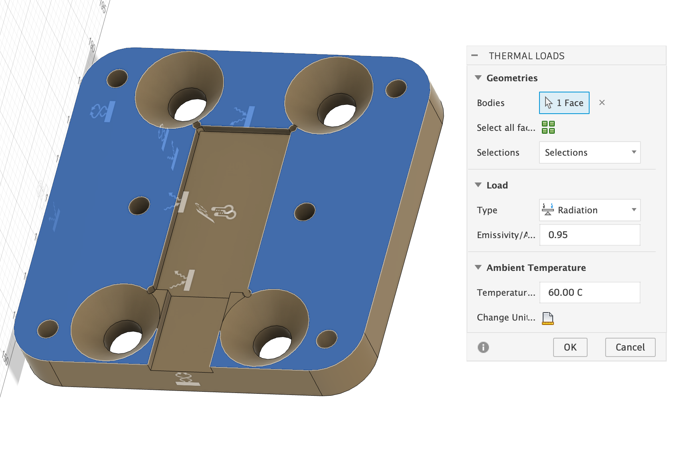<figcaption></figcaption></figure>





<figure>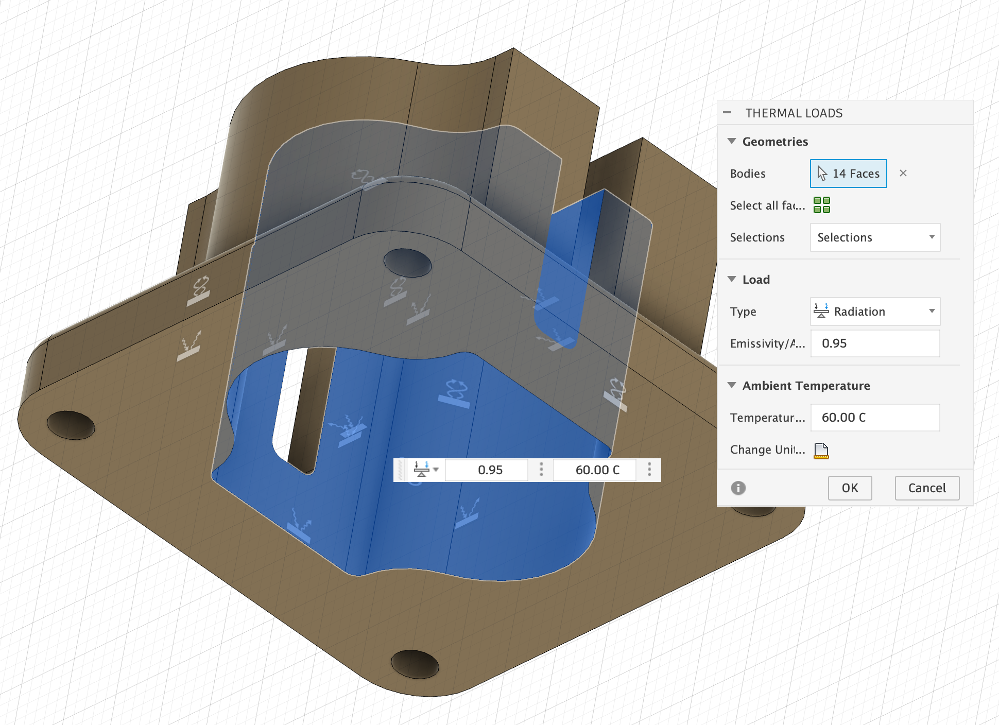<figcaption></figcaption></figure>



<figure>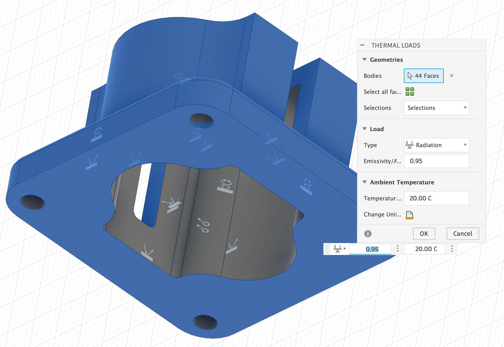<figcaption></figcaption></figure>



Caption: Following the same rule as in convection process, all surfaces included by PEEK are assigned a higher ambient temperature. Note: different materials require different radiation emissivity values.

### Add Contacts

When simulating the behavior of two components in an assembly under load conditions, we need to define a [**Contact**](https://help.autodesk.com/view/fusion360/ENU/?guid=SIM-CONTACT-TYPES) to describe the interface between them, and thereby cause the bodies to interact appropriately.&#x20;

Here, I use the automatic contacts with a detection tolerance of 0.1mm.&#x20;

<figure>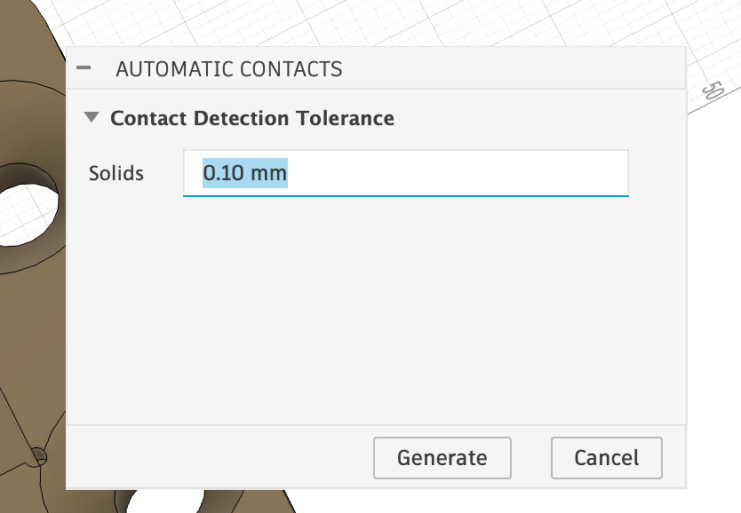<figcaption></figcaption></figure>

### Simulation Observation

After all configuration work is well prepared, do the simulation and pick a set of probe points to observe the temperature difference.&#x20;

## Result

As described above, these parameters matter a lot in our simulation

* Convection value with ambient temperature
* Radiation emissivity value with ambient temperature

To make notation more concise and clear:

For surfaces enclosed by PEEK, I label the convection value as C\_in and radiation emissivity value as R\_in\_(material).

For surfaces outside of PEEK, I label the convection value as C\_ou, and radiation emissivity value as R\_ou\_(material).&#x20;

A parameter configuration table shown below can be used to schedule the simulation work. values are followed by their ambient temperatures.

<table><thead><tr><th width="93.4765625">Task</th><th>C_in (W/m^2°K + )</th><th>C_ou (W/m^2°K)</th><th>R_in_Oven</th><th>R_in_PEEK</th><th>R_ou_PEEK</th></tr></thead><tbody><tr><td>1</td><td>3+60°C </td><td>3+20°C</td><td>0.3+60°C </td><td>0.95+60°C</td><td>0.95+20°C</td></tr><tr><td>2</td><td>3+40°C </td><td>3+20°C </td><td>0.3+40°C </td><td>0.95+40°C</td><td>0.95+20°C</td></tr><tr><td>3</td><td>8+60°C </td><td>8+20°C </td><td>0.3+60°C </td><td>0.95+60°C</td><td>0.95+20°C</td></tr><tr><td>4</td><td>8+60°C </td><td>8+20°C </td><td>0.7+60°C </td><td>0.95+60°C</td><td>0.95+20°C</td></tr></tbody></table>

We pick 6 probe points, 4 of them are at the corners of nonlinear crystal, labeled as from P1 to P6. Shown in the screenshot below.&#x20;

<figure>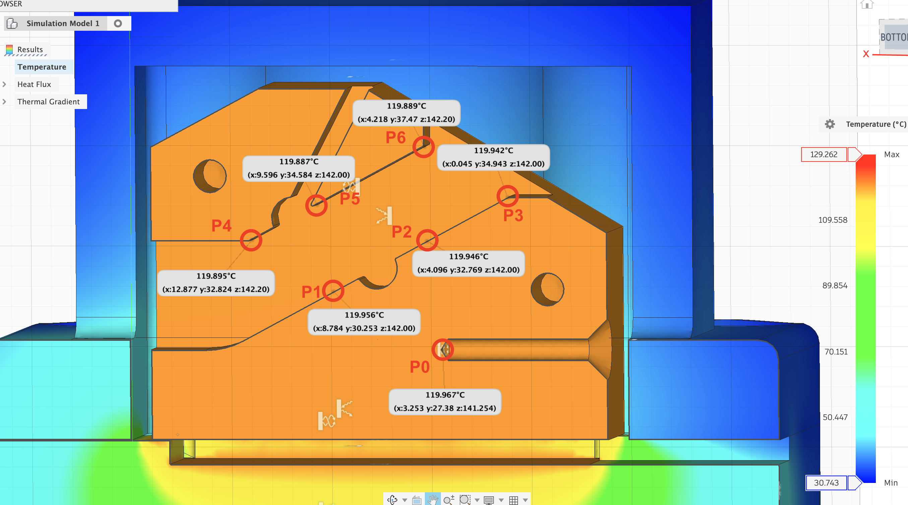<figcaption></figcaption></figure>

We repeat these tasks and take a screenshot for each simulation result



<figure>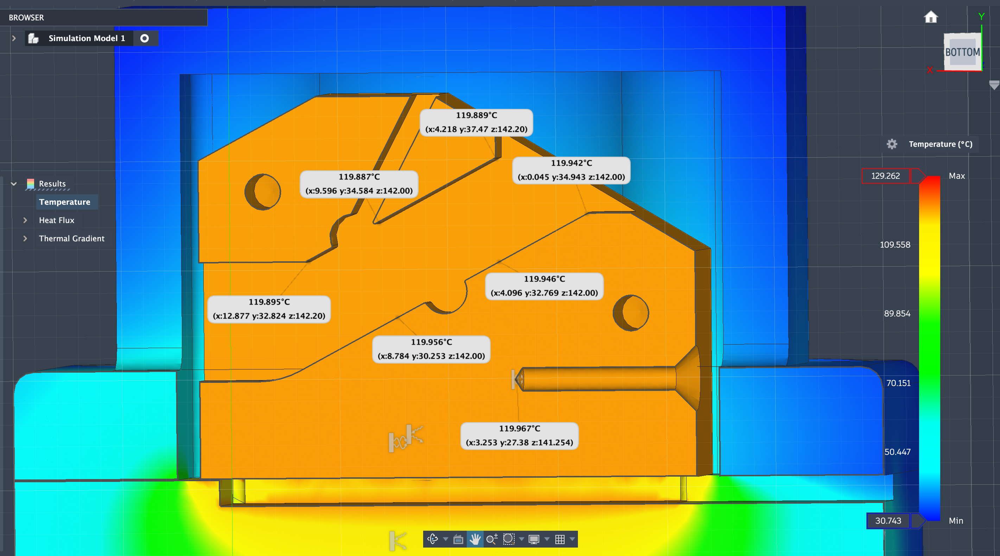<figcaption></figcaption></figure>



<figure>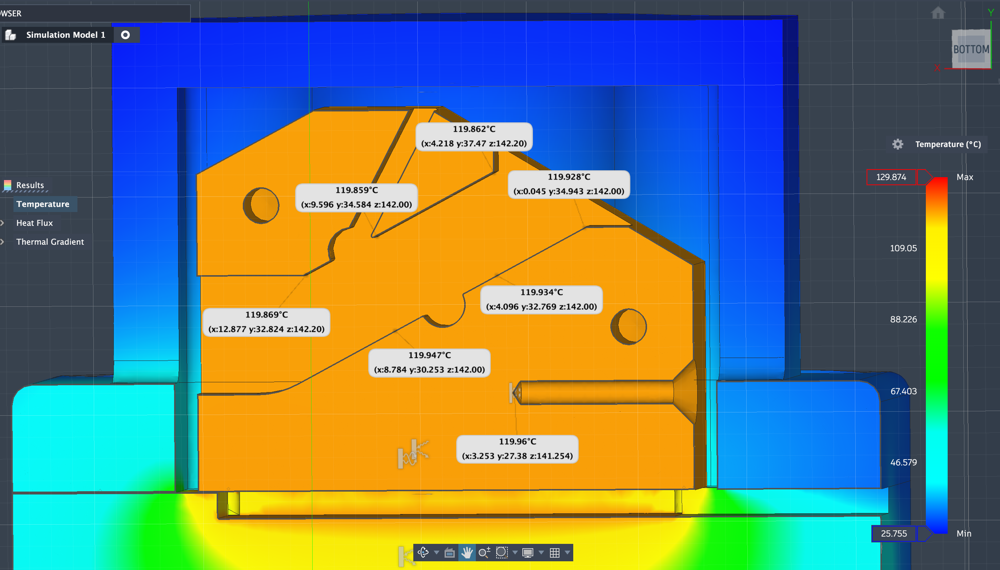<figcaption></figcaption></figure>





<figure>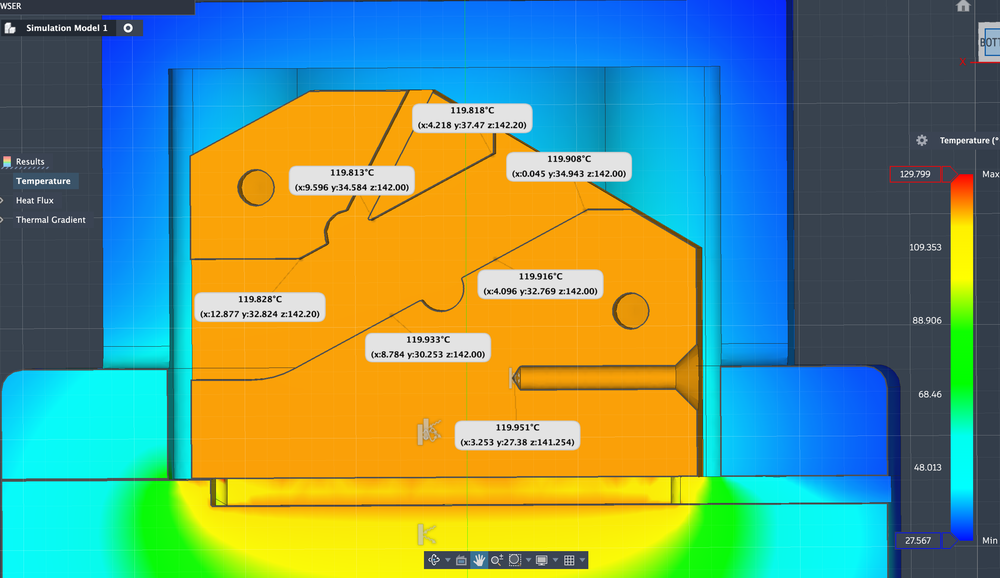<figcaption></figcaption></figure>








Detailed simulation values of these points are collected in the table below

<table><thead><tr><th width="82.1668701171875">Task</th><th>P1 (°C)</th><th>P2 (°C)</th><th>P3 (°C)</th><th>P4 (°C)</th><th>P5 (°C)</th><th>P6 (°C)</th><th>P0 (°C)</th></tr></thead><tbody><tr><td>1</td><td>119.956</td><td>119.946</td><td>119.942</td><td>119.895</td><td>119.887</td><td>119.889</td><td>119.967</td></tr><tr><td>2</td><td>119.947</td><td>119.934</td><td>119.928</td><td>119.869</td><td>119.859</td><td>119928</td><td>119.67</td></tr><tr><td>3</td><td>119.933</td><td>119.916</td><td>119.908</td><td>119.828</td><td>119.813</td><td>119.818</td><td>119.951</td></tr><tr><td>4</td><td></td><td></td><td></td><td></td><td></td><td></td><td></td></tr></tbody></table>

Through varying these two parameters, we could observe how simulation result changes, and make a reasonable judgement based off it.

## Discussion

### Some further improvements

Since in SHG experiment, the non-linear crystal lies inside the oven, so adding crystal in simulation would be a good improvement to get more trustworthy result for real use scenario.

As we've discussed, the oven is partially covered by a semi-closed PEEK container, surfaces directly exposed to outside air across a gap in the middle of PEEK definitely experience different convection conditions and radiation ambient temperatures from surfaces at deep corners inside the oven and PEEK. It would be better to split the oven surface into more fine faces and assign them more different and reasonable configurations.&#x20;

## Reference

1. &#x20;The Engineering ToolBox (2003). _Understanding Convective Heat Transfer: Coefficients, Formulas & Examples_. \[online] Available at: https://www.engineeringtoolbox.com/convective-heat-transfer-d\_430.html.
2. [https://www.engineersedge.com/heat\_transfer/convective\_heat\_transfer\_coefficients\_\_13378.htm](https://www.engineersedge.com/heat_transfer/convective_heat_transfer_coefficients__13378.htm)
3. Ghane, Mohammad & Ghorbani, Ehsan. (2016). Investigation into the UV-Protection of Woven Fabrics Composed of Metallic Weft Yarns. Autex Research Journal. 16. 10.1515/aut-2015-0021.
4. Properties of Polyetheretherketone (PEEK) transferred materials in a PEEK-steel contact\
   Debashis Puhan1 and Janet S. S. Wong1\*
5. [https://www.engineeringtoolbox.com/emissivity-coefficients-d\_447.html](https://www.engineeringtoolbox.com/emissivity-coefficients-d_447.html) 

